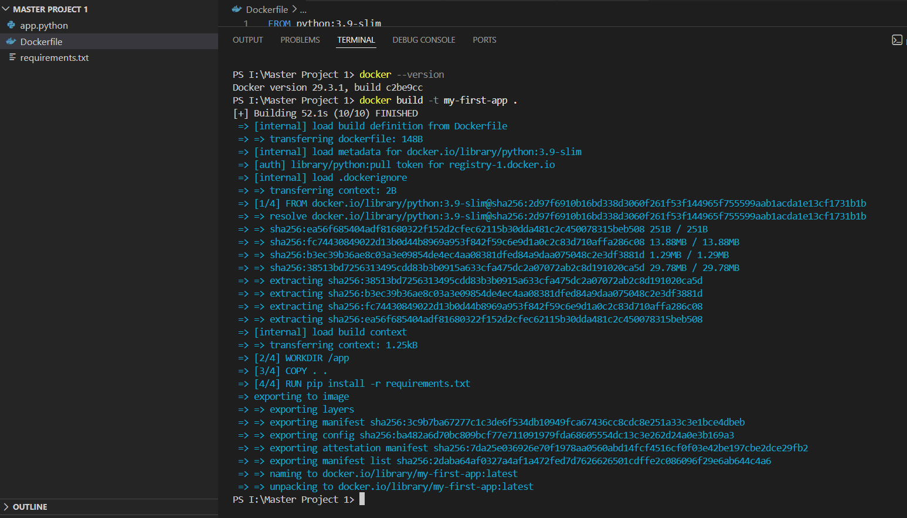
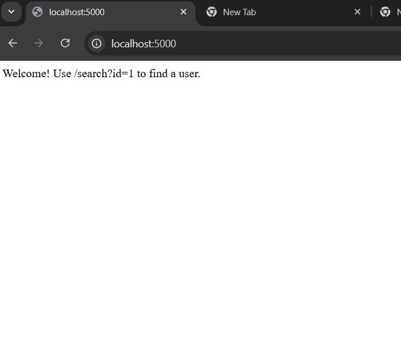
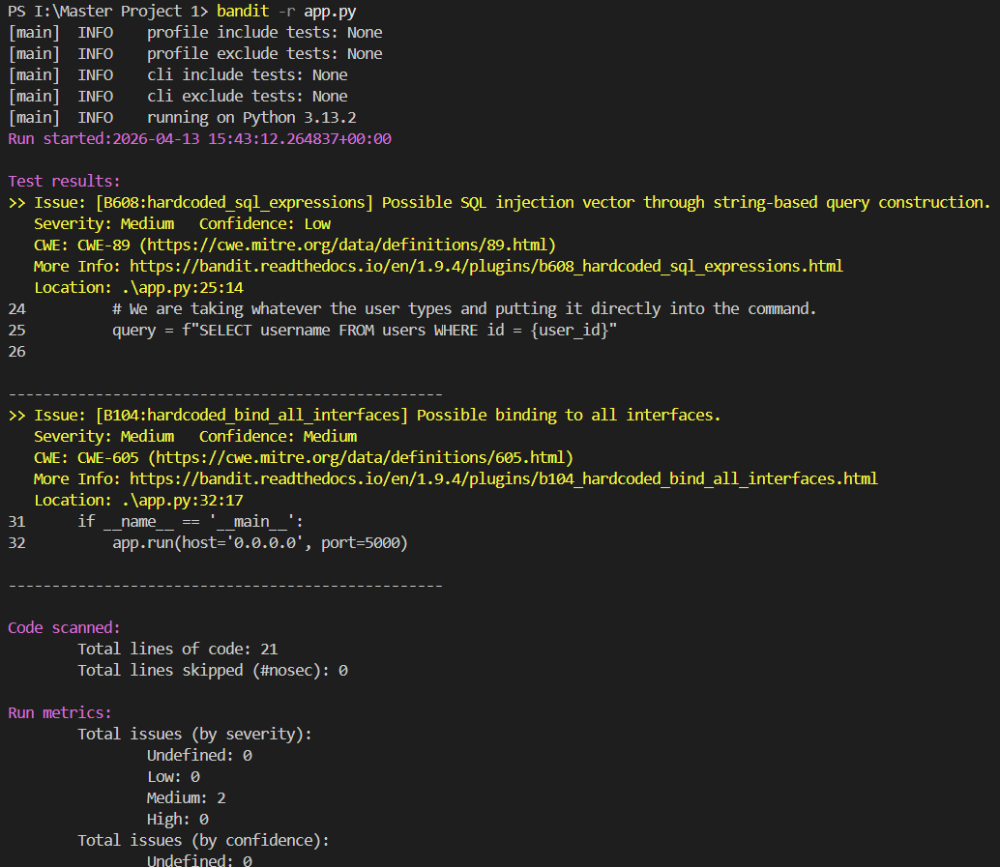
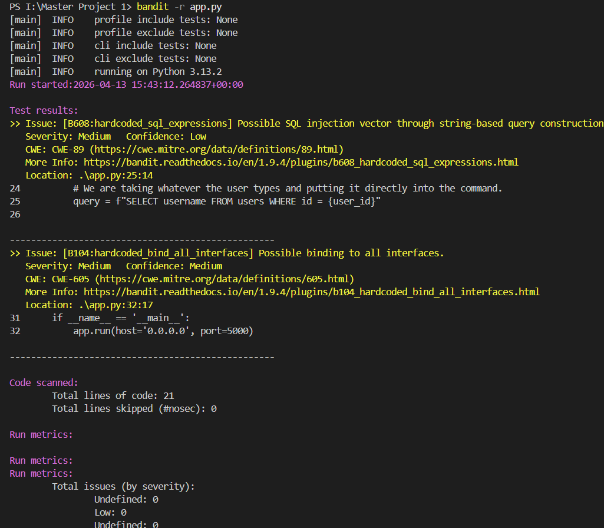
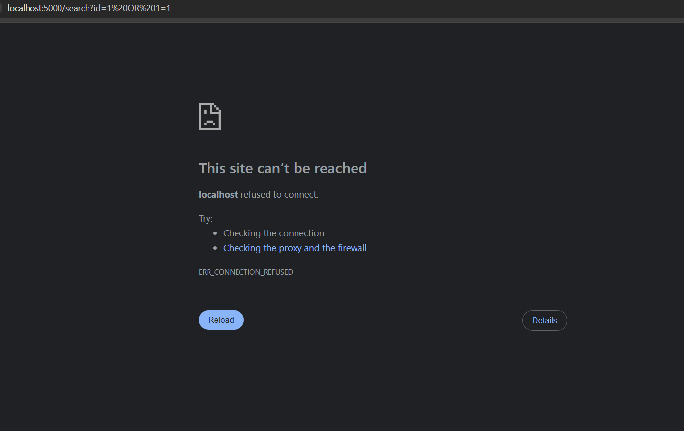

# Secure-App-Pipeline: A DevSecOps Master Project
This project demonstrates a **Shift Left** security approach by integrating automated security scanning (SAST) into a containerized Python web application
## The Challenge
The initial application contained a **CWE-89: SQL Injection** vulnerability. This flaw allowed unauthorized access to the user database by manipulating input strings.
## Security Tools
- **Docker:** Used for environment isolation and consistent deployment.
- **Bandit:** An industry-standard Static Application Security Testing (SAST) tool for Python.
## Implementation Steps
1. **Containerization:** Wrapped the Flask app in a Docker image to ensure it runs securely in any environment.
2. **Automated Scanning:** Ran `Bandit` against the source code, which identified a "Medium/High" severity SQL injection risk.
3. **Remediation:** Refactored the code to use **Parameterized Queries**, separating user input from logic.
4. **Verification:** Re-ran the security scan to confirm a "Clean" status (0 issues).
## 📊 Technical Evidence

### 1. Build & Deployment
I successfully containerized the application to ensure it runs in an isolated environment.

### 2. Security Analysis (The Vulnerability)
Running **Bandit** (Static Application Security Testing) revealed a "Medium/High" severity SQL Injection risk.

### 3. Verification & Fix
After refactoring the code to use secure query methods, the security scan passed with **0 issues**.

---

## 🛠️ Tools Used
* **Python/Flask** (Backend)
* **Docker** (Containerization)
* **Bandit** (Security Scanning)
* **Git/GitHub** (Version Control)
